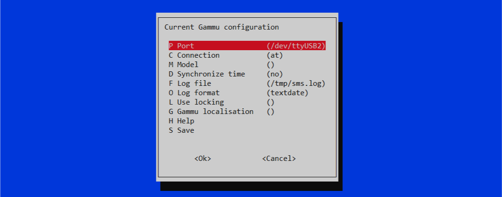

## Setup the USB dongle
After connecting the USB dongle to the device (any Linux Debian-based) by the following command we can see the list of USB devices.
```bash
lsusb
```
Possible output; _Bus 01 Device 004_ is my ZTE 4G modem.
```bash
Bus 002 Device 001: ID 1d6b:0003 Linux Foundation 3.0 root hub
Bus 001 Device 004: ID 19d2:0016 ZTE WCDMA Technologies MSM
Bus 001 Device 003: ID 046d:c52b Logitech, Inc. Unifying Receiver
Bus 001 Device 002: ID 2109:3431 VIA Labs, Inc. Hub
Bus 001 Device 001: ID 1d6b:0002 Linux Foundation 2.0 root hub
```
## Install required packages (software)
**WvDial** is a Point-to-Point Protocol dialer: it dials a modem and starts ppp in order to connect to the Internet.

**Gammu** is a project providing abstraction layer for cell phones access. It covers wide range of phones, mostly focusing on AT compatible phones and Nokia phones.
```bash
sudo apt install wvdial gammu
```

## Configure packages
Detect the GSM communication by running the following command.
```bash
sudo wvdialconf
```
Possible output; latest lines show the found GMS modem, its port, and some other configurations.
```bash
Editing `/etc/wvdial.conf'.

Scanning your serial ports for a modem.

ttyS0<*1>: ATQ0 V1 E1 -- failed with 2400 baud, next try: 9600 baud
ttyS0<*1>: ATQ0 V1 E1 -- failed with 9600 baud, next try: 115200 baud
ttyS0<*1>: ATQ0 V1 E1 -- and failed too at 115200, giving up.
ttyUSB0<*1>: ATQ0 V1 E1 -- failed with 2400 baud, next try: 9600 baud
ttyUSB0<*1>: ATQ0 V1 E1 -- failed with 9600 baud, next try: 9600 baud
ttyUSB0<*1>: ATQ0 V1 E1 -- and failed too at 115200, giving up.
ttyUSB1<*1>: ATQ0 V1 E1 -- OK
ttyUSB1<*1>: ATQ0 V1 E1 Z -- OK
ttyUSB1<*1>: ATQ0 V1 E1 S0=0 -- OK
ttyUSB1<*1>: ATQ0 V1 E1 S0=0 &C1 -- OK
ttyUSB1<*1>: ATQ0 V1 E1 S0=0 &C1 &D2 -- OK
ttyUSB1<*1>: ATQ0 V1 E1 S0=0 &C1 &D2 +FCLASS=0 -- OK
ttyUSB1<*1>: Modem Identifier: ATI -- Manufacturer: ZTE CORPORATION
ttyUSB1<*1>: Speed 9600: AT -- OK
ttyUSB1<*1>: Max speed is 9600; that should be safe.
ttyUSB1<*1>: ATQ0 V1 E1 S0=0 &C1 &D2 +FCLASS=0 -- OK
ttyUSB2<*1>: ATQ0 V1 E1 -- OK
ttyUSB2<*1>: ATQ0 V1 E1 Z -- OK
ttyUSB2<*1>: ATQ0 V1 E1 S0=0 -- OK
ttyUSB2<*1>: ATQ0 V1 E1 S0=0 &C1 -- OK
ttyUSB2<*1>: ATQ0 V1 E1 S0=0 &C1 &D2 -- OK
ttyUSB2<*1>: ATQ0 V1 E1 S0=0 &C1 &D2 +FCLASS=0 -- OK
ttyUSB2<*1>: Modem Identifier: ATI -- Manufacturer: ZTE CORPORATION
ttyUSB2<*1>: Speed 9600: AT -- OK
ttyUSB2<*1>: Max speed is 9600; that should be safe.
ttyUSB2<*1>: ATQ0 V1 E1 S0=0 &C1 &D2 +FCLASS=0 -- OK

Found a modem on /dev/ttyUSB1.
Modem configuration written to /etc/wvdial.conf.
ttyUSB1<Info>: Speed 9600; init "ATQ0 V1 E1 S0=0 &C1 &D2 +FCLASS=0"
ttyUSB2<Info>: Speed 9600; init "ATQ0 V1 E1 S0=0 &C1 &D2 +FCLASS=0"
```
Based on the findings, we can configure Gammu by running the following command.
```bash
sudo gammu-config
```
After the change, it should be like the following image.


After saving the config file, it shows the path of the config file. Remember the configuration path, we need it later.


## Get the GSM 4G modem identification
```bash
sudo gammu identify
```
Possible output; IMEI and IMSI are masked.
```bash
Device               : /dev/ttyUSB2
Manufacturer         : ZTE
Model                : MF667 (MF667)
Firmware             : BD_HDV6MF667V1.0.0B04
IMEI                 : 356xxxxxxxxxx69
SIM IMSI             : 204xxxxxxxxxx24
```

## Enter PIN/PUK code
```bash
sudo gammu getsecuritystatus
```

## Get the phone info
```bash
sudo gammu getsmsc
# OR
sudo gammu monitor 1
```
Possible output for `getsmsc`; some items are masked/changed.
```bash
Location             : 1
Number               : "+9891234567890"
Default number       : ""
Format               : Text
Validity             : Maximum time
```
Possible output for `monitor`; some items are masked/changed.
```bash
Press Ctrl+C to break...
Entering monitor mode...

Enabling info about incoming SMS    : No error.
Enabling info about incoming CB     : No error.
Enabling info about calls           : No error.
Enabling info about USSD            : No error.
SIM phonebook        :   0 used, 250 free
Dialled numbers      :   0 used,  10 free
Received numbers     :   0 used,  10 free
Missed numbers       :   0 used,  10 free
Own numbers          :   1 used,   3 free
Phone phonebook      :   0 used, 100 free
Battery level        : 100 percent
Charge state         : powered from battery
Signal strength      : -99 dBm
Network level        : 21 percent
SIM SMS status       : 0 used, 0 unread, 25 locations
Phone SMS status     : 0 used, 0 unread, 100 locations
Network state        : home network
Network              : xxx 08 (IRC, XXXXXXXXX), LAC XXXX, CID XXXXXX
Name in phone        : "XXXXXXXXXX"
Packet network state : registration to network denied
GPRS                 : detached
```

## Send SMS
```bash
sudo gammu sendsms TEXT 091234567891 -text "the message comes here..."
```

## Troubleshoot
#### [Gammu] Warning: No configuration file found!
First check if it can be run by mentioning the path of the configuration file. If you do not know the location of the config file, just run 'sudo gammu-config' one more time without saving it.
```bash
sudo gammu -c /root/.gammurc identify
```
This error comes because of two possible reasons:
1- The path of the file is not linked to the `/etc` folder properly. To fix it, create a symbolic link to the config file.
```bash
ln -s /root/.gammurc /etc/.gammurc
```
2- There is no enough privilege to run the command. Then you need to use `sudo` to run the command.
```bash
sudo gammu -c /root/.gammurc identify
```
